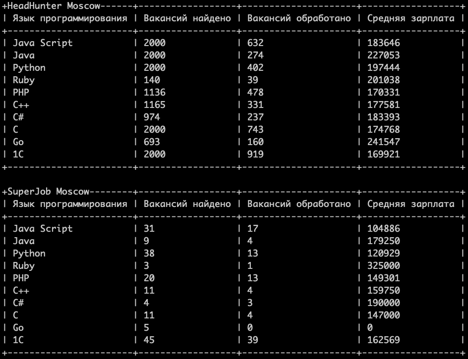

# estimate_salary

Данный проект помогает автоматизировать процесс сбора данных, предоставляемых [hh.ru](https://hh.ru) и [superjob.ru](https://www.superjob.ru), проанализировать и упорядочить статистику по зарплатам разработчиков.

Ищет вакансии по 10 популярным языкам программирования: JS, Java, Python, Ruby, PHP, C++, C#, C, Go, 1С.

Из-за ограничений API по каждой специализации скрипт скачивает до 2000 вакансий с [dev.hh.ru](https://dev.hh.ru) и до 500 с [api.superjob.ru](https://api.superjob.ru).

Выводит в консоль итоговый результат в виде таблицы.


## Установка

Должен быть установлен python3.

Рекомендуется использовать venv для изоляции проекта.

Используйте pip (или pip3, если есть конфликт с python2) для установки зависимостей:

```
pip install -r requirements.txt
```

или

```
pip3 install -r requirements.txt
```


## Ключи и параметры

Для доступа к api HeadHunter ключ не потребуется.

### Получение ключа для доступа к api SuperJob

Для данного проекта будет достаточно ключа с ограниченным функционалом.

Потребуется регистрация в качестве соискателя: https://spb.superjob.ru/resume/create/.

В случае успеха на почту придёт письмо-подтверждение с логином и паролем.

Также потребуется регистрация приложения: https://api.superjob.ru/register/.

При регистрации можно указать любой url - проверка не производится.

Полученный в результате Secret key следует сохранить в `.env` файл в директорию проекта в следующем формате:

```
SECRET_KEY=вместо этого текста вставьте ключ
```


## Запуск


### main.py

Находясь в директории проекта, откройте с помощью python3 файл `main.py`:

```
python3 main.py
```

Ожидайте вывода подобной таблицы в консоль:




## Цель проекта

Код написан в образовательных целях на онлайн-курсе для веб-разработчиков https://dvmn.org/.
